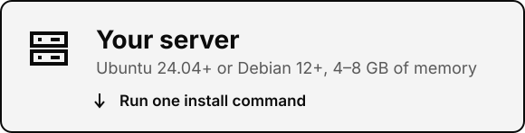
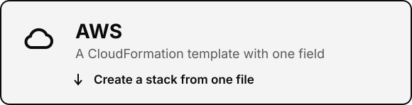

<p align="center">
  <a href="https://github.com/supavise/supavise">
    <picture>
      <source media="(prefers-color-scheme: dark)" srcset="brand/readme/banner-dark.svg">
      
    </picture>
  </a>
</p>

<p align="center">
  <b>Supavise</b> runs multiple Supabase organizations and projects on a server you control, and a second server adds read replicas and failover.
</p>

<p align="center">
  <a href="LICENSE"></a>
  <a href="deploy/README.md#install-on-a-server"></a>
  <a href="deploy/README.md#install-on-a-server"></a>
  <a href="docs/design.md"></a>
</p>

<p align="center">
  <a href="#get-started">Get started</a> ·
  <a href="docs/guide.md">Guide</a> ·
  <a href="deploy/README.md">Deploy guide</a>
</p>

---

## <picture><source media="(prefers-color-scheme: dark)" srcset="brand/readme/glyph-dark.svg"></picture>Why Supavise

Self-hosted Supabase runs one project per Docker stack, with a single-project dashboard. Supavise gives you the multi-project platform instead.

- **Many projects, one server.** Run about 20 projects with room for traffic on an 8 GB server.
- **The tools you already use.** Supabase Studio and `supabase-js` work against your server, and apps only change the URL. The Supabase CLI connects with a profile file, and AI tools such as Claude Code, Cursor and VS Code [sign in to the server's MCP endpoint with OAuth](docs/guide.md#connect-an-ai-tool-to-a-project).
- **A database for every agent.** Give each preview or AI agent its own branch or project in seconds.
- **A second server when you need one.** Join it to the first for read replicas, a planned switchover or a failover.

<p align="center">
  
  <br><sub>The real Supabase Studio, running on Supavise.</sub>
</p>

## <picture><source media="(prefers-color-scheme: dark)" srcset="brand/readme/glyph-dark.svg"></picture>Get started

<p align="center">
  <a href="#your-server"><picture><source media="(max-width: 600px) and (prefers-color-scheme: dark)" srcset="brand/readme/path-server-narrow-dark.svg"><source media="(max-width: 600px)" srcset="brand/readme/path-server-narrow-light.svg"><source media="(prefers-color-scheme: dark)" srcset="brand/readme/path-server-dark.svg"></picture></a>
  <a href="#on-aws"><picture><source media="(max-width: 600px) and (prefers-color-scheme: dark)" srcset="brand/readme/path-aws-narrow-dark.svg"><source media="(max-width: 600px)" srcset="brand/readme/path-aws-narrow-light.svg"><source media="(prefers-color-scheme: dark)" srcset="brand/readme/path-aws-dark.svg"></picture></a>
</p>

<a name="your-server"></a>**On your own server.** You need Ubuntu 24.04+ or Debian 12+ with 4–8 GB of memory and ports 80, 443, 5432 and 6543 open. A domain is optional: without one, the server gets a free `<ip>.sslip.io` address for trying things out.

```bash
curl -fsSL https://github.com/supavise/supavise/releases/latest/download/install.sh | sudo bash -s -- --email you@example.com --firewall ufw
```

The installer turns on the server's firewall with SSH and those four ports open, then prints a claim URL and a one-time token. To use your own domain, see [Install on a server](deploy/README.md#install-on-a-server).

<a name="on-aws"></a>**On AWS:**

1. Download `supavise.yaml` from the [latest release](https://github.com/supavise/supavise/releases/latest).
2. In CloudFormation, create a stack from the file, enter your email address, tick the IAM acknowledgment and create the stack.
3. When the stack is ready, open its **Outputs** tab. Run the `ClaimTokenCommand` value in AWS CloudShell to get your token.

To add a replica server later, create a second stack with `supavise-aws-deploy.sh replica` (see [Add a replica server](deploy/README.md#add-a-replica-server)).

Either way, open the claim URL, enter the token to create your admin account, and sign in. Then follow the [guide](docs/guide.md) to connect an app, use the CLI and create branches.

## <picture><source media="(prefers-color-scheme: dark)" srcset="brand/readme/glyph-dark.svg"></picture>What's included

<picture><source media="(max-width: 600px) and (prefers-color-scheme: dark)" srcset="brand/readme/features-narrow-dark.svg"><source media="(max-width: 600px)" srcset="brand/readme/features-narrow-light.svg"><source media="(prefers-color-scheme: dark)" srcset="brand/readme/features-dark.svg"></picture>

<p align="center">
  
</p>

## Updates and maintenance

Each Supavise release is a tested bundle of Supabase's services, so you track one version number. One command applies it:

```bash
sudo supavise upgrade --check   # what's new
sudo supavise upgrade           # backs up every project, rolls out with health checks, rolls back on failure
sudo -E supavise upgrade --aws  # on AWS, first brings the CloudFormation stack forward too
```

The same command moves a server and an AWS stack made by v0.1.x onto this release. It brings the host forward (`supavise system converge`) and, with `--aws`, shows a CloudFormation change set and refuses any change that would replace the instance, the data volume or the address. See [Bring a v0.1.x AWS stack forward](deploy/README.md#bring-a-v01x-aws-stack-forward). With two servers, run it on each, the leader first.

For hands-off updates, turn on automatic upgrades in a weekly maintenance window with `sudo supavise update config --mode auto --window "Sun 03:00-05:00"`. OS security patches install on their own, and project owners upgrade their own project from the dashboard, as on hosted Supabase. The [guide](docs/guide.md#updates-and-maintenance) has the full routine.

## <picture><source media="(prefers-color-scheme: dark)" srcset="brand/readme/glyph-dark.svg"></picture>How it works

<picture>
  <source media="(prefers-color-scheme: dark)" srcset="brand/readme/architecture-dark.svg">
  
</picture>

One Go program installs Supabase's open-source services and adds what self-hosting lacks: HTTPS, multiple projects, the API that the dashboard and CLI need, and backups. See [how Supavise compares](docs/guide.md#how-supavise-compares) to self-hosted and hosted Supabase, or read the [design](docs/design.md). To add a second server for read replicas and failover, see [Read replicas and failover](docs/guide.md#read-replicas-and-failover).

## <picture><source media="(prefers-color-scheme: dark)" srcset="brand/readme/glyph-dark.svg"></picture>License

[Apache-2.0](LICENSE). Supavise is not affiliated with or endorsed by Supabase Inc. It runs Supabase's open-source services.

<picture><source media="(prefers-color-scheme: dark)" srcset="brand/readme/footer-dark.svg"></picture>
