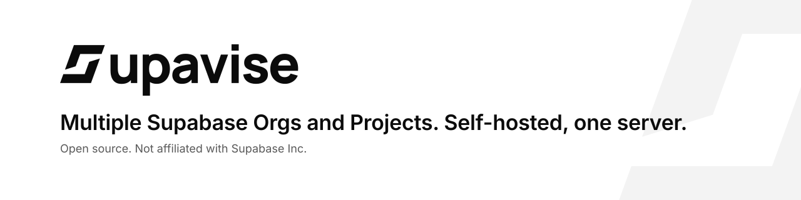
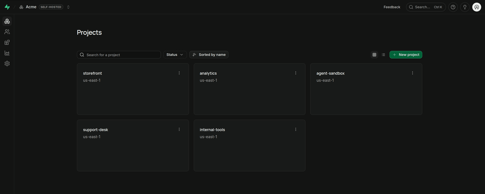
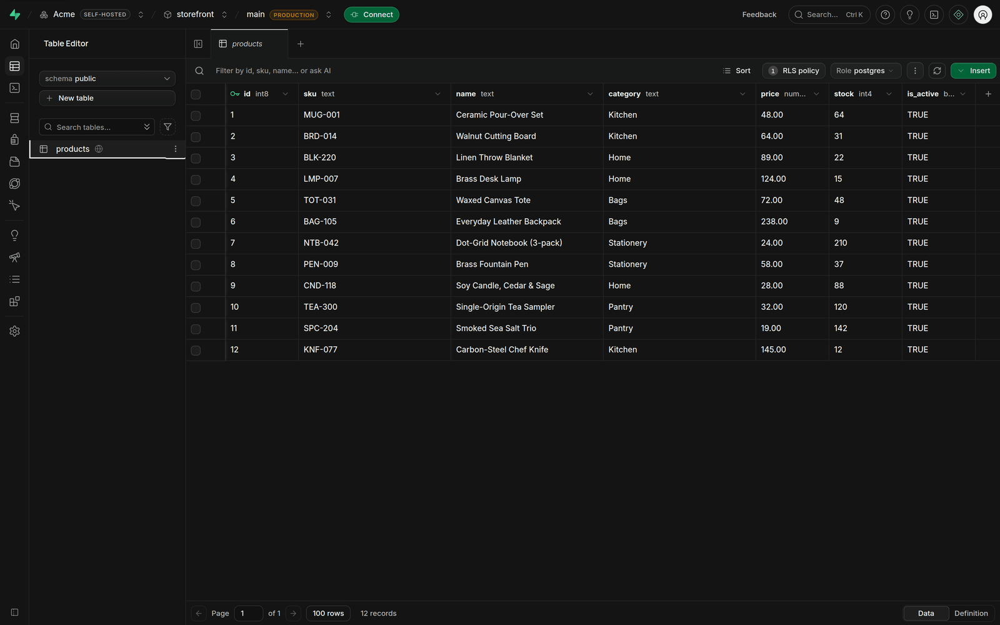
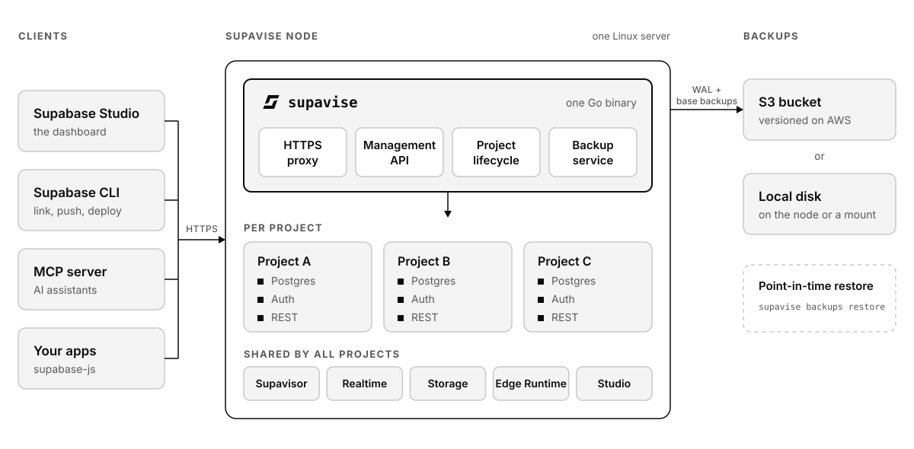

<p align="center">
  <a href="https://github.com/jsmillerdev/supavise">
    <picture>
      <source media="(prefers-color-scheme: dark)" srcset="brand/readme/banner-dark.svg">
      
    </picture>
  </a>
</p>

<p align="center">
  <b>Supavise</b> runs multiple Supabase organizations and projects on one server you control.
</p>

<p align="center">
  <a href="#get-started">Get started</a> ·
  <a href="docs/guide.md">Guide</a> ·
  <a href="deploy/README.md">Deploy guide</a>
</p>

---

## Why Supavise

Self-hosted Supabase runs one project per Docker stack, with a single-project dashboard. Supavise gives you the multi-project platform instead.

- **Many projects, one server.** Run about 20 projects with room for traffic on an 8 GB server.
- **The tools you already use.** Supabase Studio and `supabase-js` work against your server, and apps only change the URL. The Supabase CLI connects with a profile file.
- **A database for every agent.** Give each preview or AI agent its own branch or project in seconds.

<p align="center">
  
  <br><sub>The real Supabase Studio, running on Supavise.</sub>
</p>

## Get started

> [!NOTE]
> The first release isn't published yet. The download links below work once it is.

**On your own server.** You need Ubuntu 24.04+ or Debian 12+ with 4–8 GB of memory and ports 80, 443, 5432 and 6543 open. A domain is optional: without one, the server gets a free `<ip>.sslip.io` address for trying things out.

```bash
curl -fsSL https://github.com/jsmillerdev/supavise/releases/latest/download/install.sh | sudo bash -s -- --email you@example.com --firewall ufw
```

The installer turns on the server's firewall with SSH and those four ports open, then prints a claim URL and a one-time token. To use your own domain, see [Install on a server](deploy/README.md#install-on-a-server).

**On AWS:**

1. Download `supavise.yaml` from the [latest release](https://github.com/jsmillerdev/supavise/releases/latest).
2. In CloudFormation, create a stack from the file, enter your email address, tick the IAM acknowledgment and create the stack.
3. When the stack is ready, open its **Outputs** tab. Run the `ClaimTokenCommand` value in AWS CloudShell to get your token.

Either way, open the claim URL, enter the token to create your admin account, and sign in. Then follow the [guide](docs/guide.md) to connect an app, use the CLI and create branches.

## What's included

| | |
|---|---|
| **Dashboard** | The real Supabase Studio, with multiple organizations and projects |
| **Every project** | Postgres, Auth, REST, GraphQL, Realtime, Storage and Edge Functions |
| **Branching** | Schema-only branches or full copies of your data, for previews and agents |
| **Backups** | Continuous backups with point-in-time restore |
| **Teams** | Roles, invitations, SAML single sign-on and MFA requirements |
| **API keys** | Publishable and secret keys, legacy JWT keys and key rotation |
| **Operations** | Automatic HTTPS, signed self-updates and a one-field AWS template |

<p align="center">
  
</p>

## How it works

<picture>
  <source media="(prefers-color-scheme: dark)" srcset="brand/readme/architecture-dark.svg">
  
</picture>

One Go program installs Supabase's open-source services and adds what self-hosting lacks: HTTPS, multiple projects, the API that the dashboard and CLI need, and backups. See [how Supavise compares](docs/guide.md#how-supavise-compares) to self-hosted and hosted Supabase, or read the [design](DESIGN.md).

## License

[Apache-2.0](LICENSE). Supavise is not affiliated with or endorsed by Supabase Inc. It runs Supabase's open-source services.
